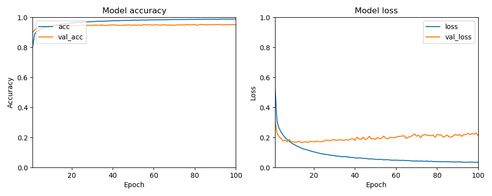
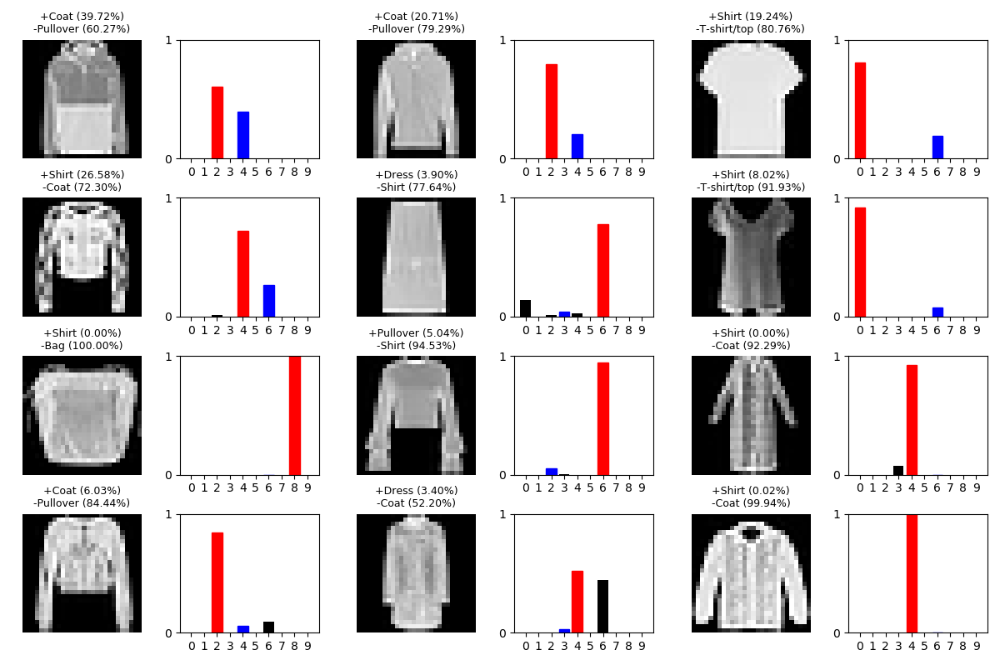
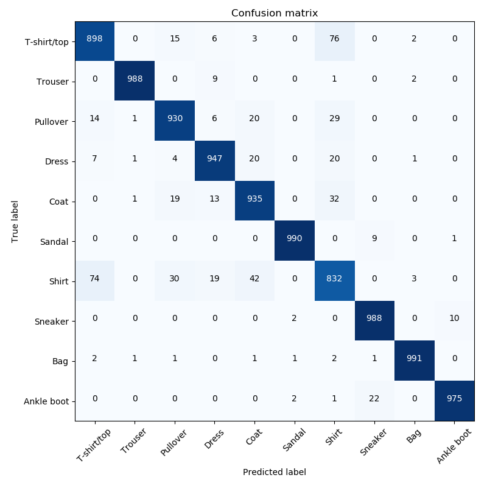

# fashion-mnist-classification

## Introduction
This project aims to create a model that can classify images of clothes from the Fashion-MNIST dataset with the best possible accuracy. The dataset itself contains a training set of 60 000 examples and a test set of 10 000 examples. Every one of the examples consists of a 28x28 image and a label specifying one of the 10 possible classes. To read more about the dataset, visit the [Fashion-MNIST repository](https://github.com/zalandoresearch/fashion-mnist).

## Methods

### k-nearest neighbors
Firstly, the k-NN algorithm (see [`knn.py`](knn.py)) was used to classify the images, with the value of k set to 5. Manhattan distance was used to measure the distance between images. Those choices were made mostly in order to later compare the results to benchmarks available [here](http://fashion-mnist.s3-website.eu-central-1.amazonaws.com/).

### Convolutional neural network
The second method is a convolutional neural network made by using the TensorFlow library. As for the loss function, cross-entropy was used. Adam optimization algorithm was chosen to be the optimizer. Here is a  summary generated by TensorFlow (with the names of the layers removed for clarity):

| Layer type         | Output Shape        | Param # |
|--------------------|---------------------|---------|
| BatchNormalization | (None, 28, 28, 1)   | 4       |
| Conv2D             | (None, 28, 28, 64)  | 640     |
| BatchNormalization | (None, 28, 28, 64)  | 256     |
| Conv2D             | (None, 28, 28, 64)  | 36928   |
| MaxPooling2D       | (None, 14, 14, 64)  | 0       |
| Dropout            | (None, 14, 14, 64)  | 0       |
| Conv2D             | (None, 14, 14, 128) | 73856   |
| MaxPooling2D       | (None, 7, 7, 128)   | 0       |
| Dropout            | (None, 7, 7, 128)   | 0       |
| Flatten            | (None, 6272)        | 0       |
| Dense              | (None, 512)         | 3211776 |
| Dropout            | (None, 512)         | 0       |
| Dense              | (None, 256)         | 131328  |
| Dropout            | (None, 256)         | 0       |
| Batch              | (None, 256)         | 1024    |
| Dense              | (None, 10)          | 2570    |

Total params: 3,458,382\
Trainable params: 3,457,740\
Non-trainable params: 642

The model takes as an input batches of images of shape (28, 28, 1). The last layer applies a softmax activation function, which outputs the probabilities of an image belonging to each class.

Besides the standard layers present in most models, there are 2 stacked convolutional layers (with normalization in between), which increase the number of parameters by a lot, but also apply the crucial filters that allow the model to push accuracy from 93% that is common in the Fashion-MNIST benchmarks into the 94% range.

The models were trained for 100 epochs with the batch size of 250.

### Data augmentation
Before the CNN model was trained, the data was split, augmented and normalized. Training set consisted of first 85% of original training images (51 000) and the remaining data was used to create a validation set (9 000). Then 2 augmented images were created for every original image (for the total of 153 000 training images). The modifications included only random horizontal flipping and random erasing with probability of 0.5. The rest of the parameters were the same as recommended in [this paper](https://arxiv.org/abs/1708.04896). Erasing function is implemented in [`erasing.py`](erasing.py), made by [yu4u](https://github.com/yu4u/cutout-random-erasing). Because of these random augmentations, the results of consecutive training runs may differ, but the differences should not be too big. The normalization process was applied on training, validation and test sets, simply by dividing every pixel by 255.

## Results

### k-nearest neighbors
The k-NN algorithm achieved an accuracy of **86.23%**. 
According to the [benchmarks](http://fashion-mnist.s3-website.eu-central-1.amazonaws.com/), the same classifier from the sklearn library, with the same settings, achieved an accuracy of 86.0%. This small deviation can be probably attributed to minor differences in the implementations (for example, which class the algorithm chooses if both of them have the same probability) and no serious conclusions should be drawn from it.

### Convolutional neural network
The best accuracy that was achieved by a CNN model was **94.74%**. The model is saved as [`best.h5`](models/best.h5). It is a checkpoint from epoch 89 (with the best accuracy on the validation set), created during training of model [`full_1.h5`](models/full_1.h5). The full model achieved an accuracy of **94.68%**. You can check both values using the [`test.py`](test.py) script. This is what the training process looked like:

The most obvious problem that the model has is seemingly overfitting the data. Even after applying a lot of dropout and normalization, the model seems to always be overfitting the training set, but the validation accuracy keeps getting better. We can take a look at some of the incorrect classifications:

And the confusion matrix:

Most misclassifications occur due to mistaking a shirt for something else. The model is quite confident in its incorrect choices, so the value of the loss function on the validation set is increased by a lot compared to the training set. I do not know how to correctly classify these images, as even a human could probably make wrong classifications. There are cases where I agree with the model's prediction. Those outliers are also probably not solvable by more data augmentations, as even with random erasing they often just look like they belong to other classes. There might be a clever way to apply some sort of a filter or feature extraction technique that I have not come across yet.

In the models folder there is also model [`full_2.h5`](models/full_2.h5), which was trained in the same way as the previous one, just with smaller drop rate in the dropout layers. It achieved the same accuracy as the previous model of **94.68%**, which again suggests that the problem might not be overfitting the data, but dealing with the outliers.

As most of the classifiers made without using any custom layers or mechanisms (according to the benchmarks in [Fashion-MNIST repository](https://github.com/zalandoresearch/fashion-mnist)) achieve a maximum of around 93%, I think that this result is quite acceptable (despite how badly the model loss chart might look like).

### Further research
The models leave a lot to be desired, but for now I have run out of time I can spend on this project. Here are some things that I think might be worth trying:

* Switch the optimizer to SGD and spend some time tuning the hyperparameters for possibly faster training.
* Try different values of drop rate or introduce more batch normalization layers to reduce overfitting
* Try to reduce the number of parameters or change the behaviour of convolutional layers, especially the size of convolution window.
* Create more robust ways of filtering and extracting features from the images.

## Usage

### k-nearest neighbors
If you just want to check the k-NN results, then prepare ~10GBs of RAM (or change data type to float32), run [`knn.py`](knn.py) (you only need numpy and the data) and wait for quite some time.

### Convolutional neural network
All the necessary Python libraries are listed in the [`requirements.txt`](requirements.txt) file. The requirements are made for the GPU version of TensorFlow, but if you want to train this model, then you should be probably using a GPU anyway.

To install them, run:

	conda install --file requirements.txt

This should work as well:

	conda create -n env python=3.7.7 numpy tensorflow-gpu scikit-learn requests matplotlib 

I really recommend using conda for this, as it makes the CUDA Toolkit and cuDNN installation very easy.

The data used to train and test the network is downloaded automatically into a *data* folder by the [`data.py`](data.py) script before doing anything else.

If you want to train the model the same way I obtained [`best.h5`](models/best.h5) or [`full_1.h5`](models/full_2.h5), then run [`train.py`](train.py) with the default settings. At the end of every training, the script will ask you for a name to save the new model or it will save it as *latest.h5*. During every training, the script will also save the model with the best accuracy on the validation set as *latest_acc.h5*. In order to train [`full_2.h5`](models/full_1.h5) you need to make 3 changes to dropout layers that are described in comments in the script.

If you want to test the models, run [`test.py`](test.py). By default, the script tests *latest.h5*. If you want to test other models put them in the *models* folder and just pass their name as an argument, for example:

	python test.py best

The script outputs the accuracy and loss function value on the test set, as well as diagrams similar to those shown in the results section.

If you want to use the saved models anywhere else, they are saved in the standard Keras .h5 format, so you can use built-in function from the library to load them (see [`models.py`](models.py)).

## Links
[Fashion-MNIST](https://github.com/zalandoresearch/fashion-mnist)

[Some benchmarks](http://fashion-mnist.s3-website.eu-central-1.amazonaws.com/)
